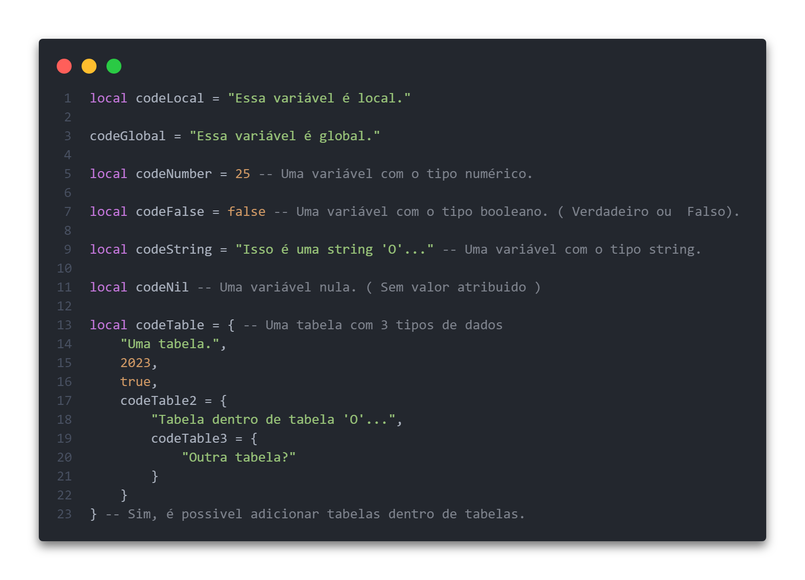

# Olá, tudo bem?

## Hoje irei iniciar a Introdução a Sintaxes da Linguagem Lua.

Como uma linguagem de fácil compreendimento a linguagem Lua tem sintaxes simples e muito parecidas com a maiorias das linguagens... para falar sobre as sintaxes primeiramente, saiba:

* O que é uma sintaxe?
 * A sintaxe de uma linguagem de programação define a gramática da linguagem. Assim como na língua natural, onde as frases seguem regras gramaticais para fazer sentido, a sintaxe em programação descreve as regras para a correta construção de instruções e expressões.

Se ainda não entendeu o que é uma sintaxe, tudo bem, irei mostrar na prática o que é...

------------------------------------------

## Comentários

Para escrever em um código sem que o <b>interpretador</b> leia, você necessita usar dos comentários.

Aqui vai um exemplo de comentário em lua:

### Legenda:
<b>Interpretador</b>: Um interpretador Lua é um software que executa o código Lua diretamente, sem a necessidade de passar por uma etapa de compilação. Ele lê e interpreta o código-fonte Lua linha por linha, executando as instruções conforme são encontradas.

------------------------------------------

## Variáveis

Como uma boa linguagem, as variáveis na linguagem lua são útilizadas para armazenar valores que podem ser reescritos, redefinindo as mesmas utilizando o operador ( = )
 
 
Para declarar uma variável sendo local ou global se usa: [ nome = valor ], caso seja local precisa específicar apenas atrás do nome adicionando "local". Não precisa específicar qual tipo de valor está adicionando, pois Lua é uma linguagem <b>tipada</b>... A diferença de uma variável local e uma global é que a global você pode mencionar fora de onde ela foi criada, já a local não, por exemplo não é possivel chamar uma variável local que foi criada dentro de uma function, irá tornar um valor nulo.
 
 
Por falar de variáveis, irei falar dos tipos de dados que existem em Lua.

- String ( Cadeia de caracteres )
- Number ( Número )
- Boolean ( Verdadeiro / Falso )
- Table ( Tabela )
- Nil ( Valor nulo )
- Function ( Função )

Aqui vai um exemplo de variável em lua:

------------------------------------------

## Operadores & Estruturas de Controle Condicionais

Claro que não poderia faltar os nossos queridos <b>operadores</b> aqui está eles:

Lua suporta os operadores matemáticos básicos, como adição (+), subtração (-), multiplicação (*), divisão (/) e módulo (%). Além disso, também possui operadores de comparação (==, ~=, <, >, <=, >=) e operadores lógicos (and, or, not). Irei explicar os operadores de comparação e lógicos a seguir:

* (>) Se usa quando se compara um valor numérico com outro valor numérico. Onde X e Y pertencem a um valor numérico, X > Y, neste caso X seria maior que Y;

* (<) Se usa da mesma forma que o (>) porém seria Y < X, Y seria menor que X;

* (>=) Com este operador de comparação se verifica valores númericos se é maior ou igual que a outro valor númerico, X >= Y;

* (<=) Neste operador de comparação se verifica se os valores que está sendo comparados é menor ou igual, ou seja, neste caso X <= Y. Estaria verificando se X é menor ou igual que Y;

* (==) Já este operador de comparação se usa para verificar se os valores são iguais. seja String ou Number, X == Y, neste caso X seria igual a Y;

* (~=) Aqui temos um operador de comparação que verifica se é diferente, ou seja, neste caso X ~= Y seria X diferente de Y, seja em questão de tipo de dados ou valor númerico.

Breve irei explicar os operadores de comparação e lógicos na prática mas antes, você deve conhecer as estruturas de controle condicionais:

* <b>if</b> o if é utilizado para condicionar situações onde o resultado da condição é verdadeiro ( se caso não entendeu veja o exemplo.)

* <b>else</b> o else é utilizado opcionalmente com o if onde o resultado da condição é falso ( se caso não entendeu veja o exemplo.)

* <b>elseif</b> o elseif é utilizado para continuar blocos de várias condições depois do if ( se caso não entendeu veja o exemplo.)

-----------------------------------------

## Estruturas de repetição

Na linguagem Lua temos 2 principais estruturas de repetição: For e While
 
 
O loop "while" executa repetidamente um bloco de código enquanto uma condição específica for verdadeira. Veja um exemplo:

 
 
O loop "for" é utilizado para repetir um bloco de código um número específico de vezes. Ele possui uma sintaxe um pouco mais flexível, permitindo especificar o valor inicial, o valor final e o incremento. Exemplo:

-----------------------------------------

## Funções

Em Lua, uma função é um bloco de código que pode receber parâmetros, executar uma série de instruções e retornar um valor (ou vários valores) como resultado. As funções em Lua são uma forma fundamental de organizar e reutilizar o código.
 
 
Para chamar uma função em Lua, utilizamos o nome da função seguido pelos valores dos argumentos entre parênteses, caso haja parâmetros.

------------------------------------------

&copy; 2023 VagalumeRico
