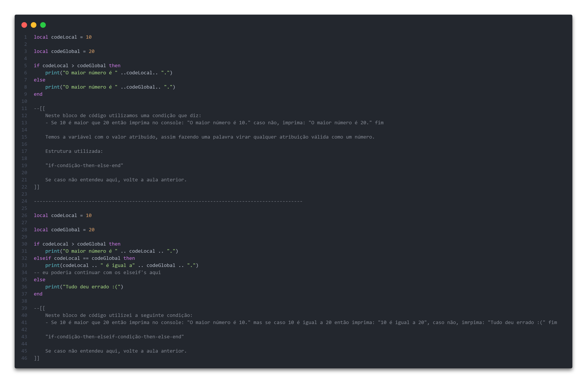
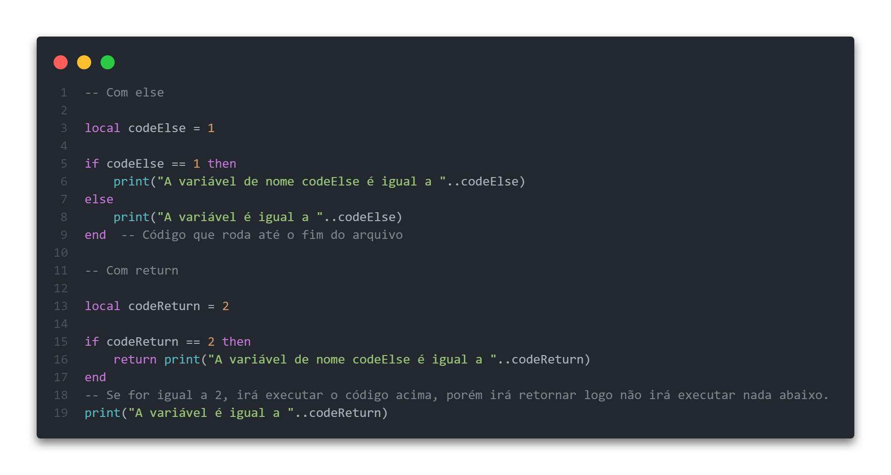

# Olá, tudo bem?

## Hoje irei iniciar a Declaração de Variáveis e Estruturas Condicionais Na Linguagem Lua.

Nessa aula iremos falar especificadamente sobre as váriaveis e estruturas condicionais, será uma aula simples, porém importante para práticamente todo código que você irá fazer.

* O que é uma variável?
 - Uma variável é um local na memória onde você pode armazenar um valor. Na linguagem Lua, você pode declarar uma variável simplesmente atribuindo um valor a ela, sendo:
* `String` ( Valor atribuido dentro de aspas simples ou duplas )
* `Number` ( Valor atribuido será um número, sendo `float` ou `int` ( inteiro ou um número quebrado ) )
* `Boolean` ( Valor atribuido é `false` ou `true` )
* `Function` ( Valor atribuido é uma função com um retorno )
* `Tables` ( Valor atribuido será uma tabela ou array, como preferir chamar. )

* O que é uma Estrutura Condicional?
 - Uma estrutural condicional permite que você execute diferentes blocos de código com base em condições específicas. Em Lua, você pode usar as estruturas condicionais "if-condição-then-else-end" e "if-condição-then-elseif-condição-then-else-end" para isso.

------------------------------------------

## Variáveis e Estrutura Condicionais

Como as váriaveis são simples, irei explicar juntamente com as estruturas condicionais...  Básicamente <b>variáveis</b>, <b>estruturas condicionais</b>, <b>estruturas de controle condicionais</b> e <b>operadores</b> funcionam juntos, ( espero que você tenha visto a aula passada, por que não irei explicar os conceitos básicos novamente... ) agora vamos praticar...

------------------------------------------

## Exemplos:

Irei citar tudo junto e eu vou explicar direitinho...

Dependendo do uso, o else dentro de uma estrutura condicional simples não é tão bom assim, mas vai da sua opnião utilizar ou não, pois executa sem parar um código, já com o return ele é útil quando você deseja retornar um valor e interromper a execução do código, fique com o exemplo abaixo:

------------------------------------------

&copy; 2023 VagalumeRico
